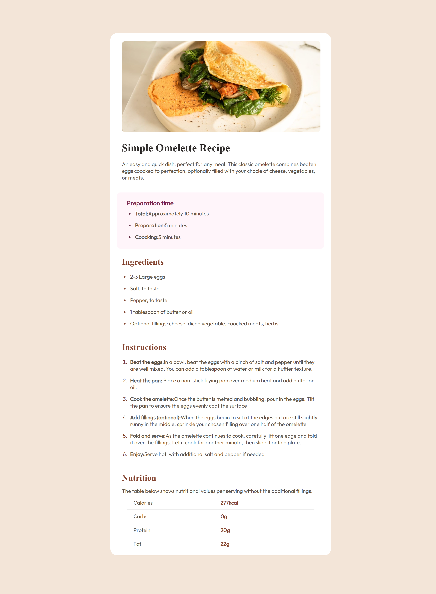

<h1 align="center">Recipe page</h1>

###

  
  
  
  
  

###

📝 Brief Your challenge is to build out this recipe page and get it looking as close to the design as possible.  You can use any tools you like to help you complete the challenge. So if you've got something you'd like to practice, feel free to give it a go.  Download the starter code and go through the README.md file. This will provide further details about the project. The style-guide.md file is where you'll find colors, fonts, etc.  Want some support on the challenge? Join our community and ask questions in the help channel.

###

https://www.frontendmentor.io/home

###

